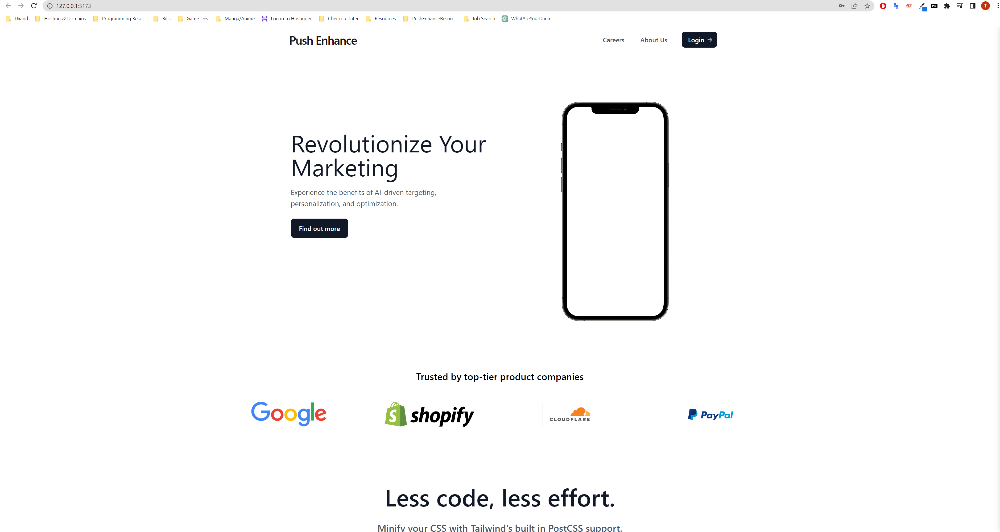
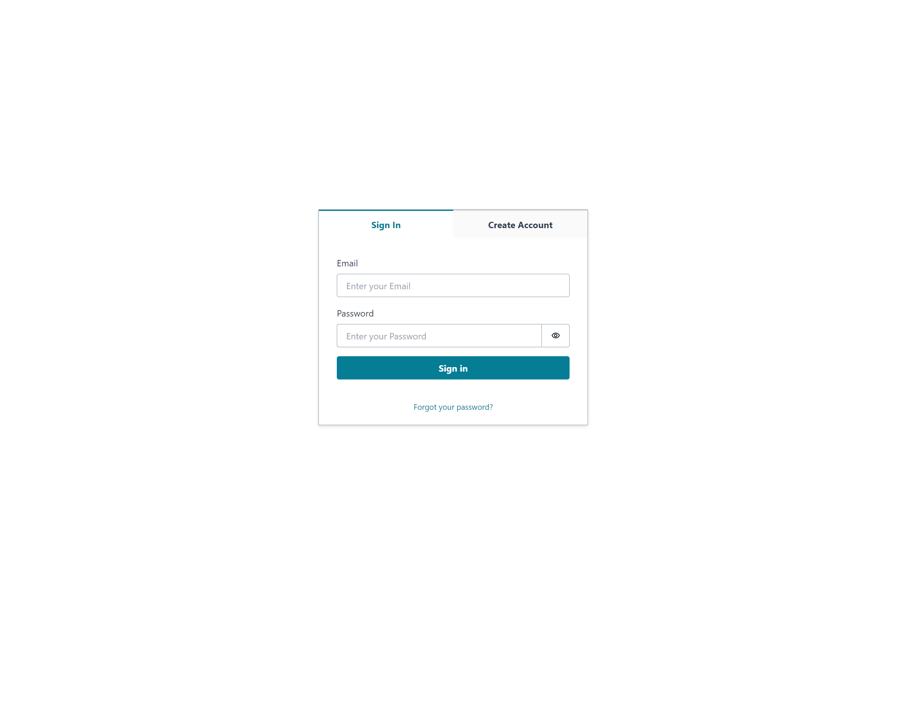
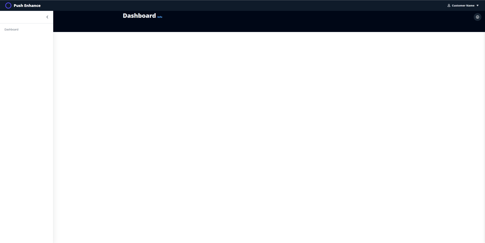

Here's an updated version of the README, showcasing a modern full-stack SaaS template built using AWS:

# Modern Frontend SaaS Template with AWS

Modern Frontend SaaS Template with AWS is a generic template designed for creating Software as a Service (SaaS) UIs within the Amazon Web Services (AWS) space. It provides a solid foundation for building a scalable and cost-efficient SaaS application that is mobile responsive and suitable for startups.

## Features

- Deploy with AWS: The template is easy to deploy with [AWS CDK toolkit](https://docs.aws.amazon.com/cdk/v2/guide/cli.html) into the AWS environment using S3, Cloudfront, and Cognito.
- Built with Modern Tech Stack: The template is built using modern technologies like React, Vite, WindiCSS (Tailwind alternative), AWS CDK, and AWS Amplify.
- Generic SaaS Template: The template provides landing pages, login, sign-up, dashboard.
- Cost Efficient: The template is cost-efficient by using static hosting or serverless architecture wherever possible.
- Mobile Responsive: The template is mobile responsive and able to adapt to different screen sizes.
- Built for Startups: The template is built with startups in mind. Very lean but thought out design decisions

## Screenshots

## Installation

1. Clone the repository.
2. Install dependencies by running `npm install`.
3. Set up your AWS account in [AWS CLI](https://docs.aws.amazon.com/cli/latest/userguide/cli-chap-configure.html)
4. Copy the `.env_example` files as `.env` and set them to your accounts.
5. Customize the application to your needs.

## Deployment
1. `cd Frontend && npm run build`
2. `cd ../Infrastructure`
3. `npm run build`
4. DEPLOY! `npm run deploy`

## Local Development
1. `npm run local`
2. you can also cd into the Frontend folder and start it.

## Recommendations
1. Highly recommend setting up [AWS budgets](https://docs.aws.amazon.com/cost-management/latest/userguide/budgets-create.html) for whatever you're comfortable spending. This should all fall under their free tier but it scale and charge to meet user needs.
2. 
## To-Do for OSC

The following tasks need to be completed:

- Add Subscription with Stripe: Add a subscription service using Stripe.
  - Add authentication with routes and subscriptions
- An Easy Way to Set Themes: Add an easy way to set themes.
- CICD Setup: Set up continuous integration and continuous deployment with CodePipeline.

## License

This project is licensed under the MIT License. See the `LICENSE` file for details.